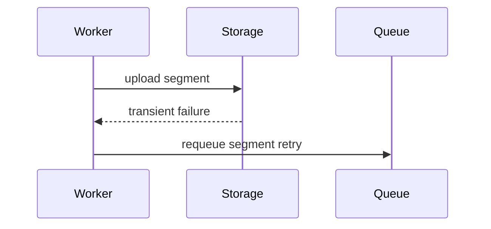

# PR Writer

Create or refresh PRs with reviewer-facing titles and bodies. The body is a
cover note, not a changelog, template, validation log, or file-by-file summary.

## Output Priorities

1. Match the full branch diff against the base branch, not the latest commit or
   stale PR text.
2. Describe the shape and effect of the change before implementation detail.
3. Explain why, risk, tradeoff, migration, or review focus only when useful.
4. Use the smallest structure that makes review easier.
5. Omit routine validation, unverified issue refs, customer data, PII,
   placeholders, and tool traces.

## Plain-Language Pass

Before creating or updating the PR, reread the title and body as a reviewer.

- Name changed behavior, affected surface, and reviewer impact.
- Avoid prompt/process words: `decision model`, `expanded contract`, `runtime
  guidance`, `validation results`, `this PR updates`.
- Replace generic sentences with specifics, or delete them.

## Body Shape

Classify the PR, then write the minimum useful body.

| Shape | Use |
|-------|-----|
| Small obvious | One concise paragraph; no headings. |
| Bug fix | Problem/root cause/fix, plus regression coverage if relevant. |
| Feature | New behavior, user/developer effect, and non-obvious approach. |
| Refactor | What moved, what behavior stays unchanged, and why it helps. |
| API/schema/payload/config/permission/event/storage/CLI | Changed contract plus compact before/after, schema, or interface if clearer than prose. |
| Breaking/removal/deprecation | Affected surface, compatibility impact, and migration/rollout guidance when known. |
| Performance/reliability | Expected impact, measured numbers when known, and tradeoffs or failure modes. |
| UI | User-visible effect; mention screenshots/recordings only when available and useful. |
| Workflow/queue/async/state/multi-service | Flow summary; use a small Mermaid diagram only if prose is harder to follow. |
| Broad/generated/cross-cutting | Organizing principle, why it is broad, and where reviewers should start. |
| Review-feedback update | Fresh description of the whole PR diff; no review-history narration. |

Default:

```markdown
<What changed and what effect it has.>

<Why this approach, tradeoff, risk, migration, or review focus matters, if not
obvious from the diff.>
```

## Optional Reviewer Aids

Use only when they reduce reviewer reconstruction work:

- `before/after`: contracts, payloads, config, CLI, or behavior comparisons.
- `schema/interface`: new or changed API response, type, event, storage record,
  config, or payload surface.
- `mermaid`: async flows, queues, retries, lifecycle, state transitions, or
  multi-component interaction.
- `screenshot/recording note`: visual UI changes when evidence exists.
- `review order`: broad, generated, mechanical, or layered diffs.
- `rollout/migration/compatibility/deprecation note`: adopters or operators must
  adjust or watch risk.
- `risk/tradeoff callout`: known limits, chosen cost, or changed failure mode.

Avoid aids that duplicate obvious code, decorate the body, or make prose less
clear. Put one sentence before an artifact telling reviewers what to notice.

## Titles

Format: `<type>(<scope>): <subject>` or `<type>: <subject>`.
For breaking changes, use `<type>(<scope>)!: <subject>` or
`<type>!: <subject>` and explain the affected surface in the body.

Allowed types: `feat`, `fix`, `ref`, `perf`, `docs`, `test`, `build`, `ci`,
`chore`, `style`, `meta`, `license`, `revert`.

Rules:

- Describe the dominant change, not the latest commit.
- Use the narrowest accurate type and scope.
- Use `!` only for breaking contract, migration, removal, or compatibility
  changes that reviewers and adopters need to notice.
- No bracketed labels: `[codex]`, `[claude]`, `[ai]`, `[bot]`, `[wip]`.
- No agent, tool, or automation attribution.
- No vague titles: `update`, `cleanup`, `misc`, `fix stuff`,
  `address feedback`.
- No trailing period.

Examples:

```text
fix(replay): Paginate recording segment downloads
feat(api)!: Emit chunk-level run log records
```

When updating a PR, keep the current title only if a reviewer reading it alone
would expect the whole branch diff against the base branch.

## Hard Negatives

- No default `Summary`, `Changes`, or `Test Plan` template.
- No empty headings, placeholders, `TODO`, `XXXXX`, or `<issue>`.
- No pasted command transcripts, CI logs, or validation dumps.
- No "tests passed" or validator summary unless it changes reviewer risk
  assessment or explains coverage for changed behavior.
- No copied commit log.
- No file-by-file narration unless needed for review order.
- No agent trace links or "action taken on behalf" lines.
- No customer/org names, user emails, support ticket contents, secrets, or PII.

For docs, skill, copy, config, or other non-runtime changes, default to omitting
validation entirely.

## Examples

### Small

```markdown
The AI Customizations section in the sessions sidebar now starts collapsed so it
does not consume space before users need it. Expanding the section keeps the
same persisted preference behavior as before.
```

### Bug Fix

```markdown
Inactive authenticated users now go through account reactivation before the
login view honors a `next` URL.

The GET login path previously redirected authenticated users without checking
`is_active`, which could bounce an inactive user between `/auth/login/` and a
protected view. The POST path already handled this case, so this applies the
same guard to GET and covers the loop with a regression test.
```

### Breaking Contract

````markdown
Run logs now emit chunk-level records instead of one skill-level record with all
findings. Consumers that read top-level `findings` need to iterate over
`chunk.findings` for each record instead.

Before:

```jsonc
{"skill": "security-review", "findings": [...], "files": [...]}
```

After:

```jsonc
{"schemaVersion": 1, "chunk": {"index": 1, "total": 2, "findings": [...]}}
```
````

### Workflow

````markdown
Replay export now retries failed segment uploads without restarting the whole
export. Successful segments stay committed, and the worker only requeues the
failed segment with the existing retry limit.

The changed flow is:


````

### Broad Or Generated

```markdown
The TypeScript API fixtures were regenerated from the updated OpenAPI schema so
client tests match the current response shapes. The generated files stay in
this PR because the schema and fixture updates are easiest to review together.

Review the schema diff first, then treat the fixture changes as generated
output from that contract change.
```

### Docs Or Skill Change

```markdown
The `pr-writer` skill now steers PR descriptions toward the full branch diff
instead of the latest commit or a generated template. Small changes should stay
short, while breaking changes, schema updates, generated diffs, and workflow
changes get the extra context reviewers need.

Schemas, before/after examples, Mermaid diagrams, rollout notes, and review
order are treated as optional reviewer aids, not default sections. Routine
validation stays out of PR bodies unless it changes review risk.
```

### Anti-Pattern: Validation Dump

```markdown
## Summary
- Updated files
- Added tests

## Test Plan
- pnpm test
- pnpm lint
```

Corrected:

```markdown
Project creation now rejects duplicate slugs before writing the project row,
which prevents the follow-up task from enqueueing work for a project that will
roll back. The regression test covers the duplicate-slug path that previously
raised after the task was already scheduled.
```

## Workflow

Requires authenticated `gh`.

Inspect branch, status, base branch, commits, and diff. For existing PRs, set
`BASE` from `baseRefName`; for new PRs, use the repo default branch:

```bash
git branch --show-current
git status --porcelain
BASE=$(gh pr view --json baseRefName --jq '.baseRefName' 2>/dev/null || gh repo view --json defaultBranchRef --jq '.defaultBranchRef.name')
git log BASE..HEAD --oneline
git diff BASE...HEAD
```

If on `main` or `master`, create a feature branch first. Ensure intended
changes are committed and the diff is reviewable as one PR.

For existing PRs, inspect current text and use `baseRefName` as `BASE`:

```bash
gh pr view PR_NUMBER --json number,title,body,url,baseRefName,headRefName
```

Refresh when follow-up commits change scope, implementation approach, breaking
behavior, risk, or final review expectations. Skip typo-only, formatting-only,
or rename-only follow-ups. Rewrite the body around the whole PR diff; do not
append review-history notes.

Create draft PR:

```bash
gh pr create --draft --title "<type>(<scope>): <subject>" --body "$(cat <<'EOF'
<description body here>
EOF
)"
```

Update existing PR:

```bash
gh api -X PATCH repos/{owner}/{repo}/pulls/PR_NUMBER \
  -f title='fix(scope): Preserve replay segment cursor' \
  -f body="$(cat <<'EOF'
<updated description body here>
EOF
)"
```

Use `gh api` for PR updates.

## Issue References

Use only when verified from user input, branch name, commits, PR comments, or
tracker output.

| Syntax | Effect |
|--------|--------|
| `Fixes #1234` | Closes GitHub issue on merge |
| `Fixes SENTRY-1234` | Closes Sentry issue |
| `Refs GH-1234` | Links without closing |
| `Refs LINEAR-ABC-123` | Links Linear issue |

These are syntax examples. Do not copy example IDs into a real PR body.

## Final Check

- Title matches the dominant full-branch change and uses `!` for breaking
  changes.
- Body length and structure match change size/risk.
- Optional artifacts reduce reviewer effort.
- Breaking changes name affected surface and migration/compatibility context.
- Routine validation is omitted unless it changes reviewer risk assessment.
- Issue references are verified or omitted.
- Customer data, PII, tool attribution, and placeholders are absent.
